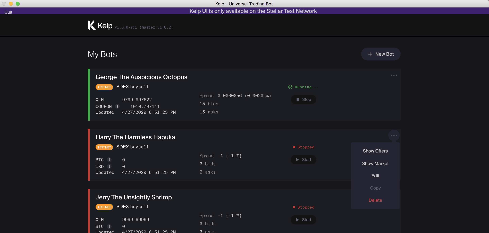

# Kelp

[][github-last-commit]
[][github-releases]
[][license-apache]

Kelp is a free and open-source trading bot for the [Stellar universal marketplace][stellarx] and for centralized exchanges such as Binance, Kraken, CoinbasePro, etc.

Kelp includes several configurable trading strategies and exchange integrations. You can define your own parameters or use the sample configurations to quickly get up and running with a trading bot in a matter of minutes. The modular design allows you to easily create new trading strategies, exchange integrations, and assets to give you full control over the bot.

Kelp is built to:

- Make spreads and make markets
- Create liquidity and facilitate price-discovery for ICOs
- Price and trade custom [stablecoins][stablecoin]
- Mimic orderbooks from other exchanges

To learn more about the Stellar protocol check out [Stellar Videos on Coinbase Earn][stellar coinbase earn], or [this video about the Stellar DEX created by Lumenauts][sdex explainer video], or read more about it on the [Stellar Website][intro to stellar].

## Be Smart and Go Slow

**Important Disclaimer: Be Smart and Go Slow.** Whenever you trade on Stellar, you are trading with volatile assets, in volatile markets, and you risk losing money. Kelp is an experimental software that contains bugs. Use Kelp at your own risk. There is no guarantee you'll make a profit from using our bots or strategies. In fact, if you set bad parameters or market conditions change, Kelp might help you lose money very fast. So be smart and go slow.

Your use of Kelp is governed by the Apache 2.0 open-source license. Please note that SDF’s interactions with you are governed by the SDF [Terms of Service][tos] and [Privacy Policy][privacy-policy].

# Table of Contents

* [Getting Started](#getting-started)
   * [How To Get Kelp](#how-to-get-kelp)
      * [Download Kelp Binary](#download-kelp-binary)
      * [Compile from Source](#compile-from-source)
   * [Running Kelp](#running-kelp)
      * [Using CCXT](#using-ccxt)
      * [Using Postgres](#using-postgres)
   * [Examples](#examples)
      * [Walkthrough Guides](#walkthrough-guides)
      * [Configuration Files](#configuration-files)
      * [Winning Educational Content from StellarBattle](#winning-educational-content-from-stellarbattle)
* [Components](#components)
   * [Strategies](#strategies)
   * [Price Feeds](#price-feeds)
   * [Exchanges](#exchanges)
   * [Plugins](#plugins)
   * [Directory Structure](#directory-structure)
   * [Accounting](#accounting)
* [Community](#community)
   * [Contributing](#contributing)
   * [Changelog](#changelog)
   * [Code of Conduct](#code-of-conduct)
   * [Project Improvements](#project-improvements)
* [Public Assets](#public-assets)

# Getting Started

## How To Get Kelp

To get started with Kelp, _either_ download the pre-compiled binary for your platform from the [Github Releases Page][github-releases] _or_ [compile Kelp from source](#compile-from-source).

There is **one** binary associated with this project: `kelp`. Once the binary is downloaded, run the bot by following the instructions in [Running Kelp](#running-kelp).

### Download Kelp Binary

You can find the pre-compiled binary for your platform from the [Github Releases Page][github-releases].

#### GUI

Here is a list of binaries for the most recent release **v1.0.0-rc2 (v1.11.0)**:

| Platform       | Architecture | Binary File Name |
| -------------- | ------------ | ---------------- |
| MacOS (Darwin) | 64-bit       | [kelp-v1.11.0-darwin-amd64.tar](https://github.com/stellar/kelp/releases/download/v1.11.0/KelpGUI__gui-v1.0.0-rc2__cli-v1.11.0__darwin-amd64.dmg) |
| Windows        | 64-bit       | [kelp-v1.11.0-windows-amd64.tar](https://github.com/stellar/kelp/releases/download/v1.11.0/KelpGUI__gui-v1.0.0-rc2__cli-v1.11.0__windows-amd64.zip) |
| Linux          | 64-bit       | [kelp-v1.11.0-linux-amd64.tar](https://github.com/stellar/kelp/releases/download/v1.11.0/KelpGUI__gui-v1.0.0-rc2__cli-v1.11.0__linux-amd64.zip) |

#### CLI

Here is a list of binaries for the most recent release **v1.11.0**:

| Platform       | Architecture | Binary File Name |
| -------------- | ------------ | ---------------- |
| MacOS (Darwin) | 64-bit       | [kelp-v1.11.0-darwin-amd64.tar](https://github.com/stellar/kelp/releases/download/v1.11.0/kelp-v1.11.0-darwin-amd64.tar) |
| Windows        | 64-bit       | [kelp-v1.11.0-windows-amd64.tar](https://github.com/stellar/kelp/releases/download/v1.11.0/kelp-v1.11.0-windows-amd64.tar) |
| Linux          | 64-bit       | [kelp-v1.11.0-linux-amd64.tar](https://github.com/stellar/kelp/releases/download/v1.11.0/kelp-v1.11.0-linux-amd64.tar) |
| Linux          | 64-bit arm   | [kelp-v1.11.0-linux-arm64.tar](https://github.com/stellar/kelp/releases/download/v1.11.0/kelp-v1.11.0-linux-arm64.tar) |
| Linux          | 32-bit arm5  | [kelp-v1.11.0-linux-arm5.tar](https://github.com/stellar/kelp/releases/download/v1.11.0/kelp-v1.11.0-linux-arm5.tar) |
| Linux          | 32-bit arm6  | [kelp-v1.11.0-linux-arm6.tar](https://github.com/stellar/kelp/releases/download/v1.11.0/kelp-v1.11.0-linux-arm6.tar) |
| Linux          | 32-bit arm7  | [kelp-v1.11.0-linux-arm7.tar](https://github.com/stellar/kelp/releases/download/v1.11.0/kelp-v1.11.0-linux-arm7.tar) |

After you _untar_ the downloaded file, change to the generated directory (`kelp-v1.11.0`) and invoke the `kelp` binary.

Here's an example to get you started (replace `filename` with the name of the file that you download):

    tar xvf filename
    cd kelp-v1.11.0
    ./kelp

To run the bot in simulation mode, try this command:

    ./kelp trade -c sample_trader.cfg -s buysell -f sample_buysell.cfg --sim

### Compile from Source

_Note for Windows Users: You should use a [Bash Shell][bash] to follow the steps below. This will give you a UNIX environment in which to run your commands and will enable the `./scripts/build.sh` bash script to work correctly._

To compile Kelp from source:

1. [Download][golang-download] and [setup][golang-setup] Golang _v1.13 or later_.
    * Confirm that `$GOPATH` is set, and that `GOBIN=$GOPATH/bin`
    * Confirm that `$PATH` includes the full filepath of `$GOBIN`
2. [Install Glide][glide-install] for dependency management
    * `curl https://glide.sh/get | sh`
3. Install [Yarn][yarn-install] and [NodeJs][nodejs-install] to build the Kelp GUI
4. Clone the repo into `$GOPATH/src/github.com/stellar/kelp`:
    * `git clone git@github.com:stellar/kelp.git`
    * Change to `kelp` directory for all following commands: `cd $GOPATH/src/github.com/stellar/kelp`
5. Install the dependencies:
    * `glide install`
6. Install the [astilectron-bundler][astilectron-bundler] binary into `$GOBIN`
    * `go get -u github.com/asticode/go-astilectron-bundler/...`
    * `go install github.com/asticode/go-astilectron-bundler/astilectron-bundler`
7. Build the binaries using the provided build script (the _go install_ command will produce a faulty binary):
    * `./scripts/build.sh`
8. Confirm one new binary file exists with version information. 
    * `./bin/kelp version`
9. Set up CCXT to use an expanded set of priceFeeds and orderbooks (see the [Using CCXT](#using-ccxt) section for details)
    * `sudo docker run -p 3000:3000 -d franzsee/ccxt-rest:v0.0.4`

## Running Kelp

Kelp places orders on the [Stellar marketplace][stellarx] based on the selected strategy. Configuration files specify the Stellar account and strategy details.

These are the following commands available from the `kelp` binary:
- `trade`: Trades with a specific strategy against the Stellar universal marketplace
- `exchanges`: Lists the available exchange integrations along with capabilities
- `strategies`: Lists the available strategies along with details
- `version`: Version and build information
- `help`: Help about any command

The `trade` command has three required parameters which are:

- **botConf**: full path to the _.cfg_ file with the account details, [sample file here](examples/configs/trader/sample_trader.cfg).
- **strategy**: the strategy you want to run (_sell_, _sell_twap_, _buysell_, _balanced_, _pendulum_, _mirror_, _delete_).
- **stratConf**: full path to the _.cfg_ file specific to your chosen strategy, [sample files here](examples/configs/trader/).

Kelp sets the `X-App-Name` and `X-App-Version` headers on requests made to Horizon. These headers help us track overall Kelp usage, so that we can learn about general usage patterns and adapt Kelp to be more useful in the future. Kelp also uses Amplitude for metric tracking. These can be turned off using the `--no-headers` flag. See `kelp trade --help` for more information.

Here's an example of how to start the trading bot with the _buysell_ strategy:

`kelp trade --botConf ./path/trader.cfg --strategy buysell --stratConf ./path/buysell.cfg`

If you are ever stuck, just run `kelp help` to bring up the help section or type `kelp help [command]` for help with a specific command.

### Using CCXT

You can use the [CCXT][ccxt] library via the [CCXT REST API Wrapper][ccxt-rest] to fetch prices and orderbooks from a larger number of exchanges. You will need to run the CCXT REST server on `localhost:3000` so Kelp can connect to it.

The CCXT-REST server **must** be running on port `3000` _before_ you start up the Kelp bot. You can list the exchanges (`./kelp exchanges`) to get the full list of supported exchanges via CCXT.

_Note: this integration is still **experimental** and is also **incomplete**. Please use at your own risk._

CCXT-rest can be run in any one of the following ways.

#### Download CCXT Binary

We have compiled the ccxt-rest v0.0.4 server as a binary for all x86 platforms (linux, darwin, windows). This is the version that Kelp currently uses.

You can find these pre-compiled binaries of the CCXT-rest server in the [releases tab here](https://github.com/stellar/kelp/releases/tag/ccxt-rest_v0.0.4).

#### Run CCXT using Docker

Install [docker][docker] (linux: `sudo apt install -y docker.io`) and run the CCXT-REST docker image configured to port `3000` (linux: `sudo docker run -p 3000:3000 -d franzsee/ccxt-rest:v0.0.4`).
You can find more details on the [CCXT_REST github page][ccxt-rest].

### Using Postgres

[Postgres][postgres] v12.1 or later must be installed for Kelp to automatically write trades to a sql database along with updating the trader config file.

## Examples

It's easier to learn with examples! Take a look at the walkthrough guides and sample configuration files below.

### Walkthrough Guides

- [Setting up a trading account](examples/walkthroughs/trader/account_setup.md): This guide uses an example token, `COUPON`, to show you how to set up your account before deploying the bot.
- [Market making for a stablecoin](examples/walkthroughs/trader/buysell.md): This guide uses the `buysell` strategy to provide liquidity for a stablecoin. 
- [ICO sale](examples/walkthroughs/trader/sell.md): This guide uses the `sell` strategy to make a market using sell offers for native tokens in a hypothetical ICO. 
- [TWAP sale](examples/walkthroughs/trader/sell_twap.md): This guide uses the `sell_twap` strategy to consistently sell tokens throughout the day. This can also be used for ICOs.
- [Create liquidity AMM for a Stellar-based token](examples/walkthroughs/trader/balanced.md): This guide uses the `balanced` strategy to create liquidty for a token which only trades on the Stellar network. 
- [Create targeted liquidity AMM within a bounded price range](examples/walkthroughs/trader/pendulum.md): This guide uses the `pendulum` strategy to create liquidty for a token. 

### Configuration Files

Each strategy you implement needs a configuration file. The format of the configuration file is specific to the selected strategy. You can use these files to customize parameters for your chosen strategy.

The following reference config files are in the [examples folder](examples/configs/trader):

- [Sample Sell strategy config file](examples/configs/trader/sample_sell.cfg)
- [Sample BuySell strategy config file](examples/configs/trader/sample_buysell.cfg)
- [Sample Balanced strategy config file](examples/configs/trader/sample_balanced.cfg)
- [Sample Pendulum strategy config file](examples/configs/trader/sample_pendulum.cfg)
- [Sample Mirror strategy config file](examples/configs/trader/sample_mirror.cfg)

### Winning Educational Content from StellarBattle

SDF sponsored a [Kelp StellarBattle in August/September 2020][kelp-battle-1], here were the winning results ([announcement][kelp-battle-1-winners]):

- [How To Create Liquidity With Kelp On The Stellar Dex (Winner)](https://medium.com/axons/how-to-create-liquidity-with-kelp-on-the-stellar-dex-5155928d4986)
- [Make use of arbitrage opportunities with Kelp bot (Runner-Up)](https://stellarupdate.com/make-use-of-arbitrage-opportunities-with-kelp-bot-653/)
- [Market Making in Stellar 101: Fundamentals & Kelp](https://rambling-ideas.salessandri.name/market-making-in-stellar-101-fundamentals-kelp/)
- [Market Making on Stellar with Kelp Quickstart Guide](https://medium.com/@dexter0x8/market-making-on-stellar-101-with-kelp-trading-bot-5adbb05c3cb9)
- [Kelp: Setup your first trading bot on the Stellar Network (using Windows)](https://edunode.org/blog/kelp)

# Components

Kelp includes an assortment of strategies, price feeds, and plugins you can use to customize your bot. Kelp also enables you to create your own trading strategies.

    
click to expand Components section

## Strategies

Strategies are at the core of Kelp. Without them it's just lazy, capable of nothing, thinking of nothing, doing nothing, like our friend [scooter][scooter video] here. The strategies give your bot purpose. Each approaches the market in a different way and is designed to achieve a particular goal.

The following strategies are available **out of the box** with Kelp:

- sell ([source](plugins/sellStrategy.go)):

    - **What:** creates sell offers based on a reference price with a pre-specified liquidity depth
    - **Why:** To sell tokens at a fixed price or at a price that changes based on an external reference price
    - **Who:** An issuer could use Sell to distribute tokens from an ICO pre-sale

- sell_twap ([source](plugins/sellTwapStrategy.go)):

    - **What:** creates sell offers based on a reference price spread over the day for a given daily sale amount
    - **Why:** To sell tokens consistently using the time-weighted-average-price (TWAP) metric
    - **Who:** An issuer could use SellTwap to distribute tokens from an ICO pre-sale in a consistent manner

- buysell ([source](plugins/buysellStrategy.go)):

    - **What:** creates buy and sell offers based on a specific reference price and a pre-specified liquidity depth while maintaining a [spread][spread].
    - **Why:** To make the market for tokens based on a fixed or external reference price.
    - **Who:** Anyone who wants to create liquidity for a stablecoin or [fiat][fiat] token

- balanced ([source](plugins/balancedStrategy.go)):

    - **What:** dynamically prices two tokens based on their relative demand (like AMMs). For example, if more traders buy token A _from_ the bot (the traders are therefore selling token B), the bot will automatically raise the price for token A and drop the price for token B. This strategy does not allow you to configure the order size but can run out of assets. This is a mean-reversion strategy.
    - **Why:** To let the market surface the _true price_ for one token in terms of another.
    - **Who:** Market makers and traders for tokens that have a neutral view on the market

- pendulum ([source](plugins/pendulumStrategy.go)):

    - **What:** dynamically prices two tokens based on their relative demand (like AMMs). For example, if more traders buy token A _from_ the bot (the traders are therefore selling token B), the bot will automatically raise the price for token A and drop the price for token B. This strategy allows you to configure the order size but runs the risk of running out of one of the two assets. This is a mean-reversion strategy.
    - **Why:** To let the market surface the _true price_ for one token in terms of another.
    - **Who:** Market makers and traders for tokens that have a neutral view on the market

- mirror ([source](plugins/mirrorStrategy.go)):

    - **What:** mirrors an orderbook from another exchange by placing the same orders on Stellar after including a [spread][spread].
    - **Why:** To [hedge][hedge] your position on another exchange whenever a trade is executed to reduce inventory risk while keeping a spread
    - **Who:** Anyone who wants to reduce inventory risk and also has the capacity to take on a higher operational overhead in maintaining the bot system.

- delete ([source](plugins/deleteStrategy.go)):

    - **What:** deletes your offers from both sides of the specified orderbook. _Note: does not need a strategy-specific config file_.
    - **Why:** To kill the offers placed by the bot. _This is not a trading strategy but is used for operational purposes only_.
    - **Who:** Anyone managing the operations of the bot who wants to stop all activity by the bot.

Refer to this [Pull Request][pr-template-new-strategy] to see an example template of a new trading strategy.

## Price Feeds

Price Feeds fetch the price of an asset from an external source. The following price feeds are available **out of the box** with Kelp:

- `crypto`: fetches the price of tokens from [CoinMarketCap][cmc]
- `fiat`: fetches the price of a [fiat][fiat] currency from the [CurrencyLayer API][currencylayer]
- `exchange`: fetches the price from an exchange you specify, such as Kraken or Poloniex. You can also use the [CCXT][ccxt] integration to fetch prices from a wider range of exchanges (see the [Using CCXT](#using-ccxt) section for details)
- `fixed`: sets the price to a constant
- `function`: uses a pre-defined function to combine the above price feed types into a single feed. We currently support only two types
    - `max` - `max(exchange/ccxt-binance/XLM/USDT/mid,exchange/ccxt-coinbasepro/XLM/USD/mid)`
    - `invert` - `invert(exchange/ccxt-binance/XLM/USDT/mid)`

## Exchanges

Exchange integrations provide data to trading strategies and allow you to [hedge][hedge] your positions on different exchanges. The following [exchange integrations](plugins) are available **out of the box** with Kelp:

- sdex (_`"sdex"`_) ([source](plugins/sdex.go)): The [Stellar Decentralized Exchange][sdex]
- kraken (_`"kraken"`_) ([source](plugins/krakenExchange.go)): [Kraken][kraken] - recommended to use `ccxt-kraken` instead
- kraken (via CCXT) (_`"ccxt-kraken"`_) ([source](plugins/ccxtExchange.go)): Kraken via CCXT - full two-way integration (tested)
- binance (via CCXT) (_`"ccxt-binance"`_) ([source](plugins/ccxtExchange.go)): Binance via CCXT - full two-way integration (tested)
- coinbasepro (via CCXT) (_`"ccxt-coinbasepro"`_) ([source](plugins/ccxtExchange.go)): Coinbase Pro via CCXT - full two-way integration (tested)
- poloniex (via CCXT) (_`"ccxt-poloniex"`_) ([source](plugins/ccxtExchange.go)): Poloniex via CCXT - only tested on priceFeeds and one-way mirroring
- bittrex (via CCXT) (_`"ccxt-bittrex"`_) ([source](plugins/ccxtExchange.go)): Bittrex via CCXT - only tested on priceFeeds and onw-way mirroring

## Plugins

Kelp can easily be extended because of its _modular plugin based architecture_.
You can create new flavors of the following components: Strategies, PriceFeeds, and Exchanges.

These interfaces make it easy to create plugins:
- Strategy ([source](api/strategy.go)) - API for a strategy
- PriceFeed ([source](api/priceFeed.go)) - API for price of an asset
- Exchange ([source](api/exchange.go)) - API for crypto exchanges

## Directory Structure

The folders are organized to make it easy to find code and streamline development flow.
Each folder is its own package **without any sub-packages**.

    github.com/stellar/kelp
    ├── api/            # API interfaces live here (strategy, exchange, price feeds, etc.)
    ├── cmd/            # Cobra commands (trade, exchanges, strategies, etc.)
    ├── examples/       # Sample config files and walkthroughs
    ├── model/          # Low-level structs (dates, orderbook, etc.)
    ├── plugins/        # Implementations of API interfaces (sell strategy, kraken, etc.)
    ├── support/        # Helper functions and utils
    ├── trader/         # Trader bot logic; uses other top-level packages like api, plugins, etc.
    ├── glide.yaml      # Glide dependencies
    ├── main.go         # main function for our kelp binary
    └── ...

## Accounting

You can use [**Stellar-Downloader**][stellar-downloader] to download trade and payment data from your Stellar account as a CSV file.

# Community

- Ask questions on the [Stellar StackExchange][stackexchange] using the `kelp` tag
- Announcements will be made on the [announcements distribution list][announcements-group]
- Community discussions (outside of questions) can take place on the [user mailing list][discussions-group]

    
click to expand Community section

## Contributing

See the [Contribution Guide](CONTRIBUTING.md) and then please [sign the Contributor License Agreement][cla].

## Changelog

See the [Changelog](CHANGELOG.md).

## Code of Conduct

See the [Code of Conduct](CODE_OF_CONDUCT.md).

## Project Improvements

- [Submit a Bug Report][github-bug-report]
- [Submit a Feature Request][github-feature-request]
- [Raise an issue][github-new-issue] that is not a bug report or a feature request
- [Contribute a PR][github-pulls]

# Public Assets

    
click to expand Public Assets section

`TEST1` and `TEST2` issued by the `GCL4KBYTRA3QYI4JTN4FWVYVYNI67W2M6XMDUB2V6ZLWFASIYHWEJPHU` account are test assets used to test Kelp on the production Stellar Network. **These assets have no value** and are marked as `auth_required` with the intent to close them off from the rest of the Stellar ecosystem. No trustlines will be accepted against these assets. As part of our testing process, you may observe a market and trades between these two tokens. It is not intended for any of these assets to represent any meaningful volume on the Stellar Network.

[github-last-commit]: https://github.com/stellar/kelp/commit/HEAD
[github-releases]: https://github.com/stellar/kelp/releases
[license-apache]: https://opensource.org/licenses/Apache-2.0
[github-issues]: https://github.com/stellar/kelp/issues
[github-issues-closed]: https://github.com/stellar/kelp/issues?q=is%3Aissue+is%3Aclosed
[github-pulls]: https://github.com/stellar/kelp/pulls
[github-pulls-closed]: https://github.com/stellar/kelp/pulls?q=is%3Apr+is%3Aclosed
[stellarx]: https://www.stellarx.com
[stablecoin]: https://en.wikipedia.org/wiki/Stablecoin
[intro to stellar]: https://www.stellar.org/learn/intro-to-stellar
[scooter video]: https://youtu.be/LStXAG5dwzA
[sdex]: https://www.stellar.org/developers/guides/concepts/exchange.html
[stellar coinbase earn]: https://www.coinbase.com/earn/stellar
[sdex explainer video]: https://www.lumenauts.com/lessons/stellar-decentralized-exchange
[bash]: https://en.wikipedia.org/wiki/Bash_(Unix_shell)
[golang-download]: https://golang.org/dl/
[golang-setup]: https://golang.org/doc/install#install
[glide-install]: https://github.com/Masterminds/glide#install
[yarn-install]: https://yarnpkg.com/lang/en/docs/install/
[nodejs-install]: https://nodejs.org/en/download/
[astilectron-bundler]: https://github.com/asticode/go-astilectron-bundler
[spread]: https://en.wikipedia.org/wiki/Bid%E2%80%93ask_spread
[hedge]: https://en.wikipedia.org/wiki/Hedge_(finance)
[pr-template-new-strategy]: https://github.com/stellar/kelp/pull/494
[cmc]: https://coinmarketcap.com/
[fiat]: https://en.wikipedia.org/wiki/Fiat_money
[currencylayer]: https://currencylayer.com/
[ccxt]: https://github.com/ccxt/ccxt
[ccxt-rest]: https://github.com/franz-see/ccxt-rest
[docker]: https://www.docker.com/
[postgres]: https://www.postgresql.org/
[kelp-battle-1]: https://stellarbattle.com/kelp-overview-battle/
[kelp-battle-1-winners]: https://medium.com/stellar-community/announcing-the-winners-of-the-first-kelpbot-stellarbattle-a6f28fef7776
[kraken]: https://www.kraken.com/
[stellar-downloader]: https://github.com/nikhilsaraf/stellar-downloader
[stackexchange]: https://stellar.stackexchange.com/
[cla]: https://forms.gle/9FBgjDnNYv1abnKD7
[tos]: https://www.stellar.org/terms-of-service
[privacy-policy]: https://www.stellar.org/privacy-policy
[announcements-group]: https://groups.google.com/forum/#!forum/kelp-announce
[discussions-group]: https://groups.google.com/forum/#!forum/kelp-talk
[github-bug-report]: https://github.com/stellar/kelp/issues/new?template=bug_report.md
[github-feature-request]: https://github.com/stellar/kelp/issues/new?template=feature_request.md
[github-new-issue]: https://github.com/stellar/kelp/issues/new
